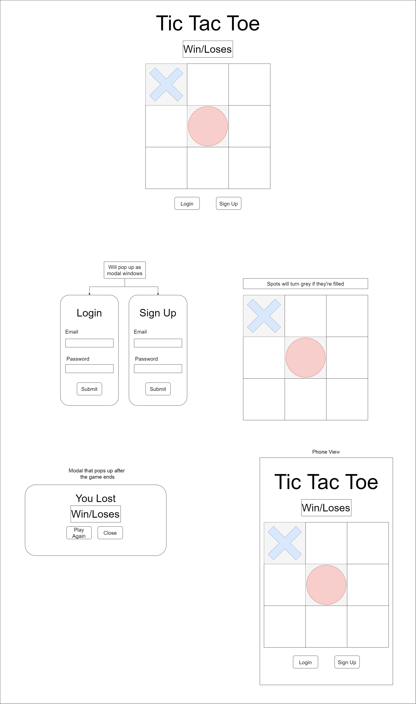

# Tic-Tac-Toe
## Intro
This is a single page application that allows users play Tic Tac Toe Locally with a friend. 
This app was built using bootstrap, sass, and jquery. With a backend that was built by general assembly.

## How To Start
First the user has to create an account then the user will need to log in. After that the user will need to create a game.
Once those steps are done the user will be able to play

## User Stories
### As a user:
- I want to be able to create an account
- I want to be able to sign into my account
- I want to be able to sign out of my account
- I want to be able to start and play a game of tic tac toe
- When playing I want to start as x then rotate between x and o
- When playing I should only be able to select empty spaces
- I want to be notified if I won or lost when the games over
- I shouldn't be able to add to the board after the game ends
- Once the game ends I should be able to play again

## Wireframes

